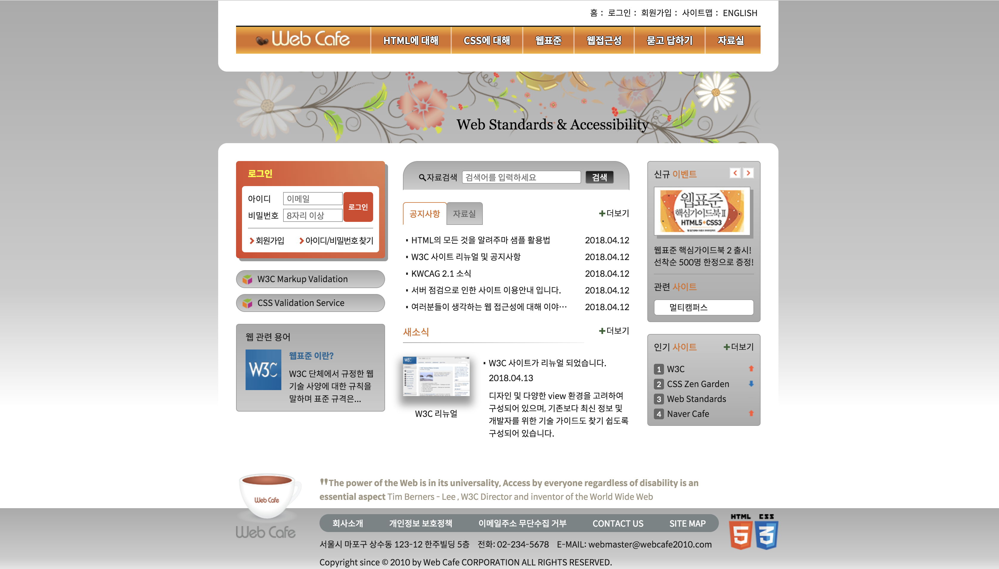
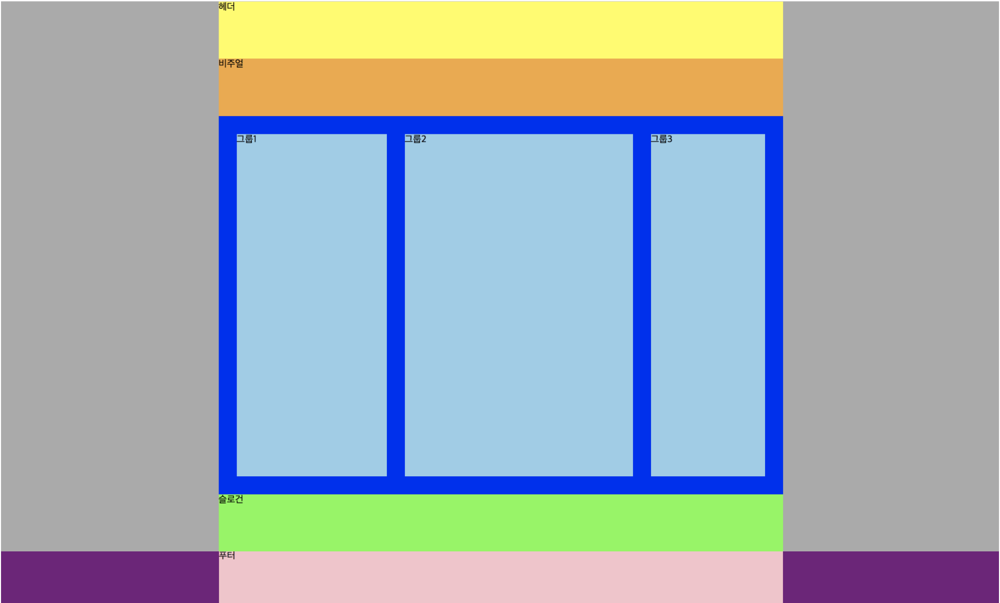
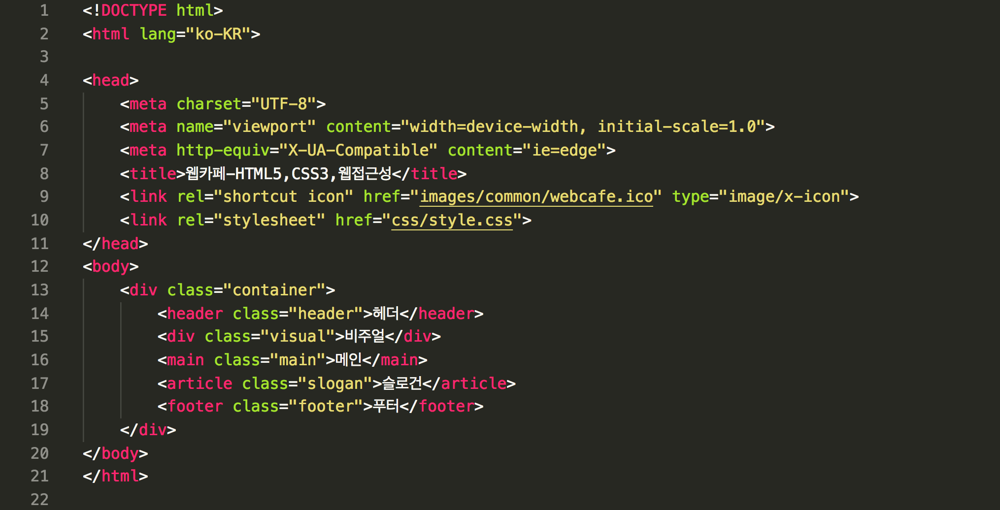
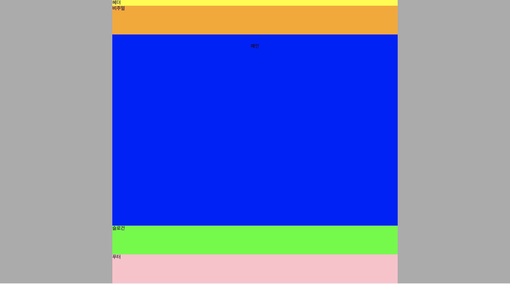

# Today I Learned

06 & 07 . SEPT . 2018

## Web Cafe 제작 해보기 실습 



위 화면에 보이는 웹사이트를 한 번 만들어보려고 해요. 많은 사람들은 웹사이트 제작을 건설에 비유하곤 하는데 전 영어공부에 비교 해 볼까 해요. 요즘에 많은 사람들이 토익시험에서 고득점을 받기 위해서 열심히 공부를 하고 있는 모습을 볼 수가 있어요. 대부분의 사람들은 서점이나 인터넷에서 '토익 1000제', '100일 안에 토익 정복하기' 같은 책들을 사서 공부를 시작하려고 하실 것 같아요. 다르게 생각하시는 분들도 계실거지만, 제가 생각했을 땐 기본 영어 문법부터 공부를 해야 할 것 같다고 생각해요ㅠㅠ(지루하고 어렵다고 생각하실 수도 있답니다). 일단 영어에 대한 기본적인 문법에 대해 이해가 되어야 단어를 암기하고 여러 문제를 접해보면서 실력이 향상되고 결국에 고득점 이라는 목표에 도달하는 것 같아요. (사실, 토익 고득점 또는 영어공부는 제가 말 한 것 보다 훨씬 복잡한 것 같답니다)

제가 하고 싶은 말은 웹사이트에서 가장 기본이되고 중요한 부분은 아무래도 <span style="color: red">깔끔하고 논리적인 마크업(markup)</span>인 것 같아요.

그럼 전체적인 구조 분석을 해야겠죠?

--

크게 보면 이런식으로 나누어 볼 수 있을 것 같아요. 자세한 설명 전에 그림으로 먼저 볼까요?




* 뼈대만들기 (전 크게 5단으로 만드려고 해요)

각 의미에 맞게 알맞는 태그로 묶어주세요.

1. header
1. div
1. main
1. article
1. footer

이 속성들을 다시 한번 div태그로 묶어줄게요. 

>div태그는 레이아웃을 위해 사용되는 의미가 없는 태그입니다.

그럼 크게 이렇게 골격이 만들어지겠죠?

1. div
1. header
1. div
1. main
1. article
1. footer

* 네이밍하기 (꾸며주기 쉽게 이름을 붙여주려 해요)

그러고 보니 div태그가 두 개가 되어버렸네요. 그럴땐 나중에 스타일을 적용 시킬 때 충돌이 없도록 네이밍을 해주도록 할게요. 이때 사용할 수 있는 것은 id=""와 class="" 선택자에요. 이 두 친구들에 대해선 다음에 한 번 더 설명하도록 할게요. 

전 class선택자를 사용해서 이름을 지어줄게요.

1. div - .container /* 전체를 감싸준다는 의미*/ 
1. header - .header /* 제목을 나타내는 의미 */
1. div - .visual /* 로고를 나타내는 부분 */
1. main - .main /* 메인 정보들이 들어갈 부분 */
1. article(독립적인 정보일 때 자주 사용) - .slogan /* 푸터 위 슬로건이 들어가는 부분 */
1. footer - .footer /* 마지막 부분 */


> div로 묶은 후 .container로 네이밍을 꼭 해야하는 것은 아니지만, 수정을 할 때 용이하기 때문에 자주 써요.

-

코드로 나타내면 어떻게 보일까요? (전, Visual Studio Code를 사용했어요)

  



```
<!DOCTYPE html>
<html lang="ko-KR">

<head>
    <meta charset="UTF-8">
    <meta name="viewport" content="width=device-width, initial-scale=1.0">
    <meta http-equiv="X-UA-Compatible" content="ie=edge">
    <title>웹카페-HTML5,CSS3,웹접근성</title>
    <link rel="shortcut icon" href="images/common/webcafe.ico" type="image/x-icon">
    <link rel="stylesheet" href="css/style.css">
</head>
<body>
    <div class="container">
        <header class="header">헤더</header>
        <div class="visual">비주얼</div>
        <main class="main">메인</main>
        <article class="slogan">슬로건</article>
        <footer class="footer">푸터</footer>
    </div>
</body>
</html>
```

* 하지만 사실 이렇게만 해서는 저 화면에 보이는 출력값을 얻을 수가 없어요! 
이렇게 보일 
이 부분은 다음번에 더 자세히 알아볼게요 :)

 
## Today I found out

웹사이트를 무작정 디자인 베이스로 만드는 것이 아니라 논리적으로 어떤 부분에 어떤 요소들이 들어가야 할 지 생각해서 뼈대를 만드는 것이 가장 기본이 되어야 한다는 것을 알게 되었어요. 수업시간에 하는 이번 실습이 끝나고 스스로 새로운 웹사이트를 제작할 생각에 벌써부터 신이 나네요!!!!

## Reference

HTML과 CSS : [HTML&CSS](https://www.w3.org/html/)

생활코딩 HTML : [HTML](https://opentutorials.org/course/2039)

생활코딩 HTML : [CSS](https://opentutorials.org/course/4)


