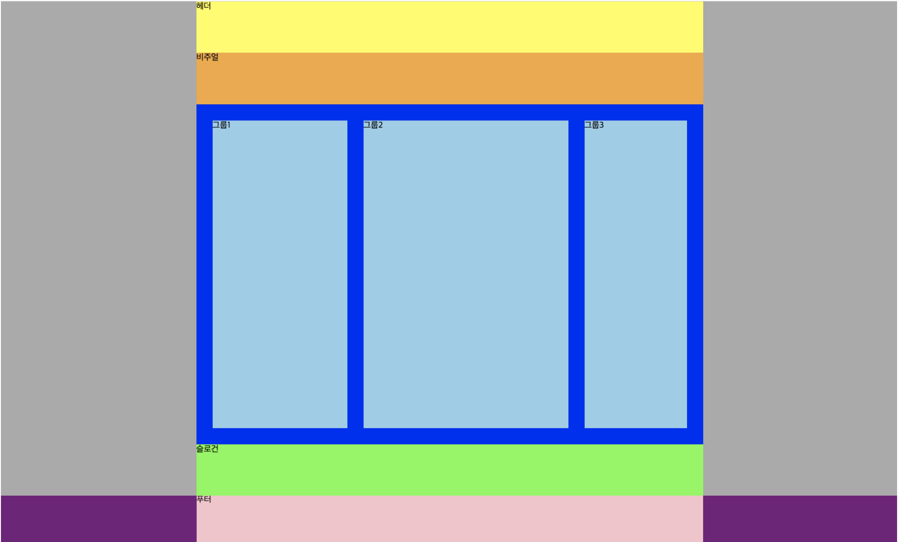

# Today I Learned

07 . SEPT . 2018

## Web Cafe 제작 해보기 실습 

자 먼저 이 그림에 저번 코드에 적용된 CSS부터 한번 보고 갈게요

 

각 태그에 지금 색깔이 적용 된 것이 보이나요?  저번에 작성했던 태그 `<head>`태그 안을 살펴보면 `<link rel=link rel="stylesheet" href="css/style.css"`이라는 부분을 찾을 수 있을 거에요. stylesheet의 링크 경로가 css라는 폴더 안에 style.css라는 파일이라고 말해주고 있는거에요. 

style.css를 보기 전에 기본 구조에 클래스 이름 지정을 어떤식으로 했는지 한 번 더 보고 갈게요.

>1. div - .container 
1. header - .header 
1. div - .visual 
1. main - .main 
1. article - .slogan 
1. footer - .footer 


그럼 css코드를 한번 볼까요?


```
/* CSS를 활용한 레이아웃 및 UI 디자인 */
body{
    margin: 0;
}
/* 레이아웃 */
.container{
    background-color: #aaa; /* 백그라운드 색 회색*/
}
.header, .visual, .main, .slogan, .footer{
    width: 940px;
    margin: 0 auto; 
}
/* 헤더 */
.header {
    background-color: yellow;
}
/* 비주얼 */
.visual {
    background-color: orange;
    height:10vh; /* vh 요소는 높이값의 100분의 1의 단위 */
}
/* 메인 */
.main {
    background-color: blue;
    height:60vh;
    padding: 30px 0;
}
/* 슬로건 */
.slogan{
    background: lime;
    height: 10vh; 
}
/* 푸터 */
.footer {
    background-color: pink;
    height:10vh;
}

```
-
그런데 우리는 어떤 구조가 화면에 출력되길 원했을까요?



과연 뚜둔! 달라져야 하는 부분은 어디일까요? 두 군데 입니다!

1. 메인태그 안에 정렬된 세 부분
1. 푸터와 높이는 같이만 밑에 길게 있는 부분

그럼 이 부분을 차근차근 한번 만들어 볼게요! 푸터 부분부터 만들어 볼게요.

footer태그를 감싸는 div태그를 만들어서 footer-bg라고 클래스 이름을 지정 해볼까요?

	
		<div class="footer-bg">
            <footer class="footer">푸터</footer>
      	</div>


그럼 이번엔 스타일도 적용 해볼까요?


그리고 확인해보면 보라색 부분을 볼 수 있을 거에요.

-

이번엔 메인태그 안에 3개의 그룹을 추가 해준 뒤에 정렬을 해줄 거에요. 조금 어려울 수 있어요(전 처음에 엄청 어렵게 느껴지더라구요ㅠㅠ)


메인 태그 안에 div태그 3개를 추가하고 각 group1,2,3으로 클래스 이름을 지정 해 주세요. 그 다음 메세지를 입력해 볼게요.


* <span style=color:red>변경사항이 하나 있어요!! 전 원래 코드에서 `<main>`태그 안의 메인이라는 글씨를 지워줬어요!!!!!</span>


        <main class="main"> 
            <div class="group group1">그룹1</div>
            <div class="group group2">그룹2</div>
            <div class="group group3">그룹3</div>
        </main> 


이번에도 스타일을 적용해 볼게요. 그런데 이번엔 좀 어려운 개념이 등장해요! 

최대한 간단하고 쉽게 설명해볼게요! 

css에서 <span style=color:red>flex모델</span>을 사용하면 우리가 원하는 모양으로 화면에 출력시킬 수 있을 거에요.
Flexbox 모델을 사용하려면 먼저 flex-container를 정의해주어야 하는데, 부모 속성 안에 자식 속성이 속하도록 만들어 주어야 해요. (전 자식 요소인 div태그들에 class 이름을 두 개 주었습니다.)
       


본격적으로 flex모델을 사용해서 스타일을 적용하도록 해볼게요.


간단하게 설명을 해보면, 

1. display:flex; [먼저 부모요소의 display를 flex로 한다고 지정]
1. flex-direction:row; [자식 요소들의 배열 방향을 row(행)으로 한다고 지정]
1. justify-content: space-evenly [자식 요소들 사이의 공백의 크기를 똑같이 해준다고 지정]

flex모델의 자세한 설명은 다음에 한 번 자세하게 설명해보도록 할게요. 

자, 이렇게 하고 나면 우리가 원하는 출력 값을 드디어 얻을 수 있답니다! 그럼 이제 본격적으로 헤더 부분부터 코딩을 시작해 볼까요?


## References


W3C HTML 요소 설명 : [HTML ELEMENTS 속성](https://www.w3schools.com/html/html_blocks.asp)

CSS FLEX : [Flex CSS](https://css-tricks.com/snippets/css/a-guide-to-flexbox/)

Flex 알아보기:[Flex 우리말 설명](https://www.vobour.com/1-flexbox-%EC%9D%B4%ED%95%B4-%EB%8B%B9%EC%8B%A0%EC%9D%B4-%EC%95%8C%EC%95%84%EC%95%BC-%ED%95%A0-%EB%AA%A8%EB%93%A0-%EA%B2%83-understa)