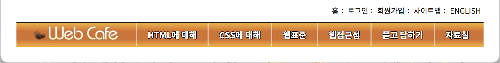
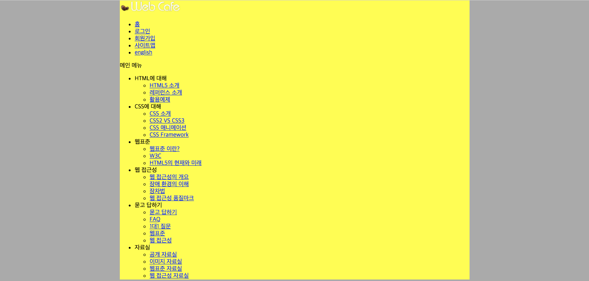

## Today I learned

08.Sept.2018

오늘은 위에 보이는 헤더에 해당되는 부분을 HTML로 코딩을 해보려고 해요. CSS는 아직 적용하지 않도록 할게요.

    
		 <header class="header">
            <h1 class="logo"></h1>
            <ul class="member">   /* ul태그로 감싸줄 거에요 */
                <li>
                    <a href="#">홈</a>
                </li>
                <li>
                    <a href="#">로그인</a>   /* 링크에 입력 할 주소는 나중에 삽입하도록 할게요 */
                </li>
                <li>
                    <a href="#">회원가입</a>
                </li>
                <li>
                    <a href="#">사이트맵</a>
                </li>
                <li>
                    <a href="#">ENGLISH</a>
                </li>
            </ul>
            
            
 * 상단에 보이는 홈 | 로그인 | 회원가입 | 사이트맵 | ENGLISH를 위한 코드였어요.

           
 * 그 다음 하단에 보이는 HTML에 대해서 | CSS에 대해 | 웹표준 | 웹접근성 | 묻고 답하기 | 자료실 은 Nav태그를 이용해서 묶어주도록 할게요.

    
   
  		   <nav class="navigation">  
              <h2 class="readable-hidden">메인 메뉴</h2> 
              				/* 나중에 이 부분은 CSS를 사용해서 읽을 수는 있지만 숨겨진 영역으로 만들어 볼거에요
                <ul class="menu">
                				/ "li - ul - li*3" 인 구조입니다 /
                    <li class="menu-item" tabindex="0"> / 웹접근성을 통과하기 위해선 마우스를 사용하지 않고, 키보드 tab키만으로도 모든 객체에 접근이 가능해야만 한다 /
                        HTML에 대해 
                        			/ 이 부분에 커서를 대면 아래에 보이는 서브메뉴가 나타게 만들어주기 위해 리스트 목록을 하위 리스트 목록을 추가시켜 줄게요 /  
                        <ul class="sub-menu">
                            <li>
                                <a href="#">HTML5 소개</a>
                            </li>
                            <li>
                                <a href="#">레퍼런스 소개</a>
                            </li>
                            <li>
                                <a href="#">활용예제</a>
                            </li>
                        </ul>
                    </li>
                    <li class="menu-item" tabindex="0">   
                        CSS에 대해
                        <ul class="sub-menu">
                            <li>
                                <a href="#">CSS 소개</a>
                            </li>
                            <li>
                                <a href="#">CSS2 VS CSS3</a>
                            </li>
                            <li>
                                <a href="#">CSS 애니메이션</a>
                            </li>
                            <li>
                                <a href="#">CSS Framework</a>
                            </li>
                        </ul>
                    </li>
                    <li class="menu-item" tabindex="0">
                        웹표준
                        <ul class="sub-menu">
                            <li>
                                <a href="#">웹표준 이란?</a>
                            </li>
                            <li>
                                <a href="#">W3C</a>
                            </li>
                            <li>
                                <a href="#">HTML5의 현재와 미래</a>
                            </li>
                        </ul>
                    </li>
                    <li class="menu-item" tabindex="0">
                        웹 접근성
                        <ul class="sub-menu sub-menu4">
                            <li>
                                <a href="#">웹 접근성의 개요</a>
                            </li>
                            <li>
                                <a href="#">장애 환경의 이해</a>
                            </li>
                            <li>
                                <a href="#">장차법</a>
                            </li>
                            <li>
                                <a href="#">웹 접근성 품질마크</a>
                            </li>
                        </ul>
                    </li>
                    <li class="menu-item" tabindex="0">
                        묻고 답하기
                        <ul class="sub-menu">
                            <li>
                                <a href="#">묻고 답하기</a>
                            </li>
                            <li>
                                <a href="#">FAQ</a>
                            </li>
                            <li>
                                <a href="#">1대1 질문</a>
                            </li>
                            <li>
                                <a href="#">웹표준</a>
                            </li>
                            <li>
                                <a href="#">웹 접근성</a>
                            </li>
                        </ul>
                    </li>
                    <li class="menu-item" tabindex="0">
                        자료실
                        <ul class="sub-menu">
                            <li>
                                <a href="#">공개 자료실</a>
                            </li>
                            <li>
                                <a href="#">이미지 자료실</a>
                            </li>
                            <li>
                                <a href="#">웹표준 자료실</a>
                            </li>
                            <li>
                                <a href="#">웹 접근성 자료실</a>
                            </li>
                        </ul>
                    </li>
                </ul>
            </nav>
        </header>
        
        
        

이렇게 입력하고 화면에 출력되는 부분을 확인해 볼까요?

 
 
아직 스타일을 적용시키지 않았기 때문에 화면에 출력 되는 부분이 멋있어 보이지 않을 수가 있어요.

다음엔 로고에 해당되는 부분을 움직여 보려고해요 :)

        
  