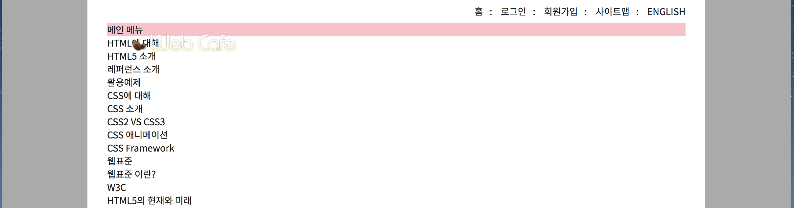
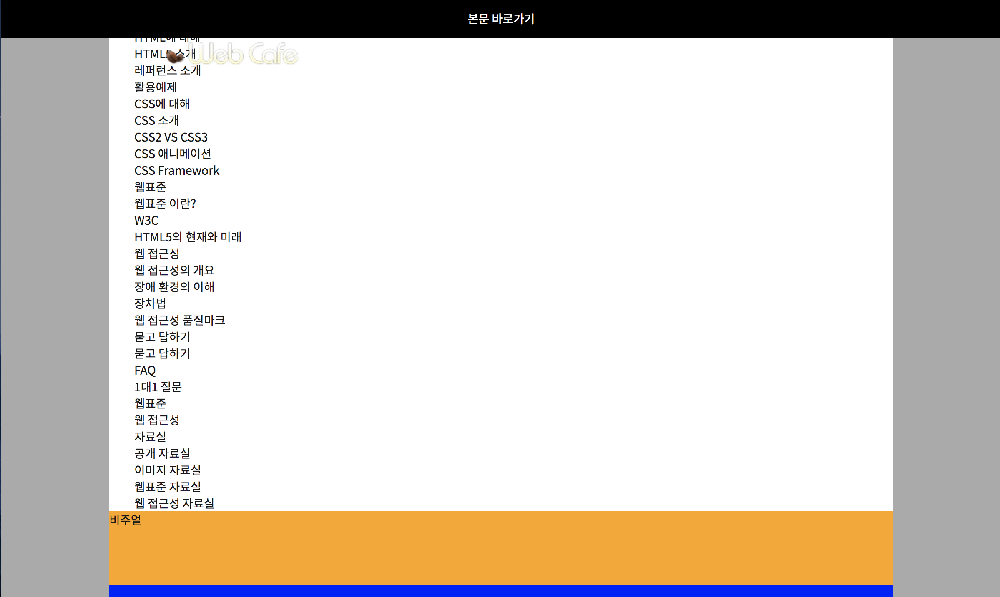
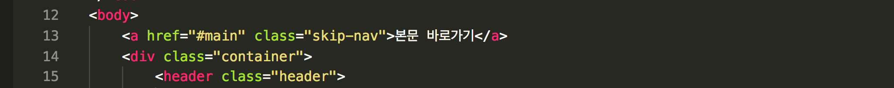
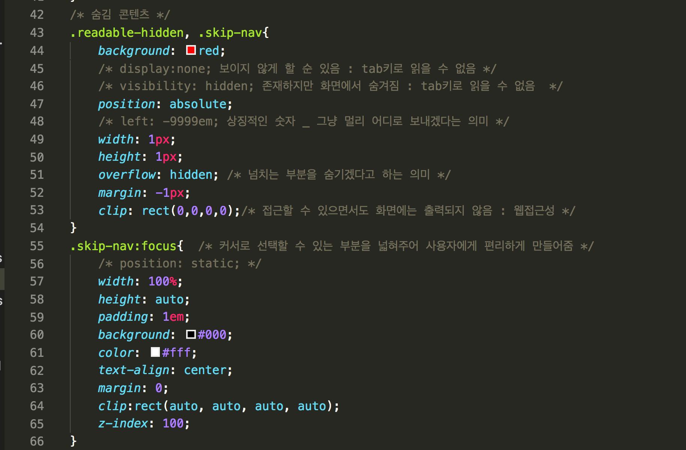

## 10.Sept.2018

# Today I Learned

> Monday quiz
> 
> 특정 기능이 지원되지 않는 브라우저 상에서 기능을 구현하는 코드를 일컫는 용어인 이것은?  			정답 : 폴리필
> 
> _______ 은(는) position 속성 중 상대적 위치에 자리하다가 뷰포트 상 특정 위치에 도달하면 위치가 고정되는 값이다. relative와 fixed의 특성을 모두 보여주지만, 아직 브라우저 호환성이 부족한 이 값은? 		정답 : sticky(스티키)
> 
> position : relative 속성은 자신의 static 포지션일 때의 위치를 기준으로 움직인다. / position : absolute 속성은 부모를 기준으로 움직인다. /  position : fixed 속성은 브라우저의 화면을 기준으로 움직인다. 
> 
> 선택자에 대한 설명으로 올바른 것은?
> 정답. : 속성 선택자는 [ ]를 이용한다. (ex. a[href="#"] {})
자식요소를 선택하기 위해서는 > 를 사용한다. (ex. #main > div {})
형제요소를 선택하기 위해서는 +나 ~를 사용합니다.(ex. .group1, .group2, .group3{} )
클래스 선택자를 아무리 많이 더하여 사용해도, ID 선택자보다 우선할 수는 없다.

> 박스모델(Box-model) : padding과 border, margin은 width에 포함되지 않는다. (box-sizing: border-box이면 margin만 미포함)
-

## 에이전트 스타일 (Agent Style)를 초기화 시키는 리셋스타일 / 리셋 CSS(Reset CSS) 

### Reset CSS vs Normalize

#### Reset CSS : 여백을 0으로 만들어 놓고 시작

Eric Myer reset css reference : [Eric Myer reset css code](https://cssreset.com/scripts/eric-meyer-reset-css/)

	html, body, div, span, applet, object, iframe,
	h1, h2, h3, h4, h5, h6, p, blockquote, pre,
	a, abbr, acronym, address, big, cite, code,
	del, dfn, em, img, ins, kbd, q, s, samp,
	small, strike, strong, sub, sup, tt, var,
	b, u, i, center,
	dl, dt, dd, ol, ul, li,
	fieldset, form, label, legend,
	table, caption, tbody, tfoot, thead, tr, th, td,
	article, aside, canvas, details, embed, 
	figure, figcaption, footer, header, hgroup, 
	menu, nav, output, ruby, section, summary,
	time, mark, audio, video{
	
	margin: 0;
    	padding: 0;
    	border: 0;
    	font-size: 1em;
    	font: inherit;
    	vertical-align: baseline;

	}

* 단위 / Dom tree 검색

	+ em : 상속
	+ rem : root를 기준

* font속성

	+ font-size : 
		`normal, italic | oblique | oblique <angle>`
	+ font-weight : 
		`normal | bold | lighter | bolder | <number>`
	+ font-variant : 
		`normal | none, etc`
		etc ref : [font-variant](https://developer.mozilla.org/en-US/docs/Web/CSS/font-variant)
	+ line-heignt : 
		`normal | <number> | <length> | <percentage>`
	+ font-size : 
		`xx-small | x-small | small | medium | large | x-large | xx-large | <relative-size> values | <length> values | <percentage> values | Global values`
	+ font-family : 
		`ex) serif | san-serif | etc`
	+ font-stretch :
		`normal | semi-condensed | condensed | extra-condensed | ultra-condensed | semi-expanded | expanded | extra-expanded | ultra-expanded | <percentage> `

> If font is specified as a shorthand for several font-related properties, then: it must include values for: font-size, font-family /  it may optionally include values for: font-size, font-variant, font-weight, font-height

* 리스트 태그 스타일링

		ol, ul {
			list-style: none;  
			/* 리스트 스타일 none하면 불릿표시 사라짐_
			ol태그에도 사용할 수 있지만 그럼 순서가 사라져
			ol태그의 목적을 잃음 */ 
		}	
		table {
			border-collapse: collapse;
			border-spacing: 0;  
			
			/* cell-spacing, border-collapse,
			border-spacing 개념정리 */
		}

#### Nomalize : 

[github_normalize](https://github.com/necolas/normalize.css/blob/master/normalize.css)

/**
 * 1. Correct the line height in all browsers.
 * 2. Prevent adjustments of font size after orientation changes in iOS.  (orientation changes : landscape / portrait
 */

> html {
  line-height: 1.15; /* 1 * / 
  -webkit-text-size-adjust: 100%; /* 2 */
}

Normalize css : [개발용, 배포용](https://cdnjs.com/libraries/normalize)

> @import url("https://cdnjs.cloudflare.com/ajax/libs/normalize/8.0.0/normalize.min.css");

> /* normalize css 링크를 예제 css파일 맨 위에 붙여넣기 */

-

#### 하이퍼링크 스타일

	 a:link _ 방문안함 : 파란색
	 a:visited _ 방문함 : 보라색
	 a:hover_ 마우스 hover  : 빨간색
	 a:focus _ 키보드  : 빨간색
	 a:active_ 활성화 : 빨간색  (요즘 잘 안씀)

상속과 특정요소에 직접적인 효과를 주었을 때 일어나는 상황에 대해 생각해보기!
겹침, 상속, 우선순위 이슈!

예제에 스타일 적용시키기

		a{
			color: inherit;
			text-decoration: none; 
			/* 화면에 출력되고 있었던 밑줄 없앰 */
		 }

-

#### Web font적용한 스타일

Google Web font : [web font](https://fonts.google.com/)

* Serif (문자 가로획의 시작이나 끝부분에 붙어있는 장식, 세로기둥과 줄기의 끝부분에 맵시를 내거나 가독성을 높이기 위해 붙인 획이 있는 글꼴)   
* Sans-serif (세리프(Serif, 장식)이 없는 글꼴 / 고딕체같은 반듣한 글꼴)

> @import url('https://fonts.googleapis.com/css?family=Noto+Sans+KR:400,700');  /* css시트 맨 위에 추가 _ 요청만 한 상태*/ 

css 시트에 html에 적용할 수 있게 불러와봅시다 
				
		/* 본문스타일 */
		body{ 
    		color: #181818;
    		background-color: #fff;
    		font-family: "Noto Sans KR", sans-serif;
    		font-weight: 700;
			font-size: 1.4rem;	 	
			}

-
## 실전예제로 돌아가서 ul요소로 마크업한 .member 스타일링하기

* 디자인을 Grid(그리드)기반으로 예쁘게 시스템 디자인을 하는게 효율적으로 코드짜는게 효율적

		<ul class="member">
                <li>
                    <a href="#">홈</a>
                </li>
                <li>
                    <a href="#">로그인</a>
                </li>
                <li>
                    <a href="#">회원가입</a>
                </li>
                <li>
                    <a href="#">사이트맵</a>
                </li>
                <li>
                    <a href="#">english</a>
                </li>
            </ul>
            
* flex 사용
   
            
 		.member{
   	 		background:yellow;
    		display: flex;
    		justify-content: flex-end;

		}
		
* float(속성)사용

		.clearfix::after{
    		content:"";
    		display: block;
		}
		

		/* 멤버 링크 */
		.member {
   			 background: yellow;
 			 float: right;
   			 width: 100%;
			}
		.member li{
  			 float: right;
			}
			
			
* inline / inline-block(값) 사용 : 실습예제에서 사용한 방법!!!!

		.member {  /* <header>아래 <ul>선택자의 클래스 네임*/
    		background: yellow;
    		text-align: right; /* 텍스트 정렬 방향 */
    		font-size: 0;
    		padding: 2px 0x;
    		margin-right: -10px; /* 오른쪽에서 반대로 -10px이동 */
					}
		.member li, .member a{
    		display: inline-block; 
    				/*인라인요소의 성격과 블록요소의 성격을 모드 살림*/
    				}
		.member li{
    		font-size: 1.4rem; /*글씨크기*/
					}
		.member li:nth-child(n+2)::before{
    		content: ":"; 
    		/* ::before은 값들의 앞에 가상의 값을 만들어줌 + 
    		content:"원하는 출력값" 을 꼭 적어주어야함 _ 
    		출력값엔 아무것도 안적어도됨 */
    		}
		.member a{      
 	   		font-size: 1.4rem; 
    		text-transform: uppercase;
    		padding: 8px 10px; 
    			/* a태그를 감싸고 있는 부분의 패딩을 추가함 */
			}

-

### 무너진 레이아웃 되돌리기

		*, *::before, *::after{
	    box-sizing: border-box;
			}
	/* 전체 선택자와, 전체 가상요소들에게 박스 사이징을 보더박스로 지정*/
	/* why? content-box(w/h+p+b+m)/border-box(w/h[p+b]+m) */
		

-

#### 구조 선택자 (복잡하고 동적일경우)

	.member li:nth-child(n+2)::before{
   		content: ":"
		}
		
nth-child 알아보기 : [Mastering the :nth-child](http://nthmaster.com/)

화면 출력 

   	

-

### 웹 접근성

탭키를 눌러 키보드로 커서를 이동시켜야하는 장애인들의 경우에, 기본 메뉴를 지나치고 밑에 본론으로 바로 넘어갈 수 있게 만들어 보다 편리하게 웹사이트를 이용 할 수 있게 만들어 줄 수 있는 부분이 바로 이 부분인 것 같다.

숨김 콘텐츠 만들기

body태그 바로 밑에 `<a href="#main" class="skip-nav">본문 바로가기</a>`를 추가 시켜보자. a href="#main"은 이 html문서 안에서 id 선택자가 main인 부분을 링크 건다는 말이다. 그 말인 즉, 우리는 이 키보드로만 확인 해 볼 수 있는 이 숨겨진 부분을 선택해서 누르면, 메인으로 바로 넘어간다는 말이다! 그렇다면 main태그를 찾아 `<main class="main" id="main">` id값을 할당해 주어야 한다. 

화면 출력

그렇담 CSS를 이용해서 이 부분을 보이지 않게 하는 스타일을 적용해보자.

CSS파일

-

## Today I learned

원래 주어진 에이전트 스타일을 리셋시키는 방법이 있다는 것을 알게되어 다행이라고 생각했다. 일일이 설정하지 않고 미리 원하는 설정 값으로 지정을 한 후에 새롭게 값을 적용하면서 작업을 할 수 있다고 생각하니 참신한 기능이라고 생각했다. web font를 이용하는 방법 등 여러가지 새로운 개념들과 방법들을 알게되었다. 기본 개념은 천천히 차근차근 읽어보니 이해가 잘 가지만, 이것들을 가지고 프로젝트를 진행하게 될 때 어떤 버그들을 만날까 심히 걱정이 앞선다ㅠㅠ

