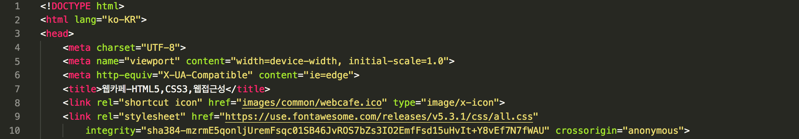

11.Sept.2018

## Today I Learned

* Tuesday Quiz

1. 단축속성 

font-size는 무조건 font-style, font-variant, font-weight보다 앞에 나와야 한다.

단축 속성은 동시에 여러 다른 CSS 속성값을 설정하게 하는 CSS 속성이다.

font는 단축 속성으로 적을 때 size와 family를 꼭 포함해야 한다.

font-family가 가장 마지막에 적혀야 한다.

2. 컨테이너 관련 속성은 상속되지 않는다.

3. 스타일링하려고 하는 html 파일과 같은 폴더에 들어있는 style.css 파일을 가져오려고 합니다. link 태그를 작성하세요.

```
<link rel="stylesheet" href="./style.css">
<link rel="stylesheet" href="style.css">
<link rel='stylesheet' href='style.css'>
<link rel="stylesheet" type="text/css" href="style.css">
<link type="text/css" rel="stylesheet" href="style.css">
<link href="style.css" type="text/css" rel="stylesheet">
<link rel="stylesheet" href="style.css" type="text/css">
<link type="text/css" href="style.css" rel="stylesheet">
```


-

* 어제 배운 것 요약

1. display : inline | inline-block (모양은 inline이지만 width/height값 할당 할 수 있음)| block | etc.
1. inherit : 상속
1. Reset vs Nomalize : 스타일 초기화
1. Web font
1. 선택자. : 구조선택자 [nth-child]

-


# 오늘 할 내용 : 정적인 디자인 설계 (오전) | 동적인 제어 (오후)
	
1. 구조분석 
1. 디자인 설계

#### 1. 구조분석

```
<header.header>
	<nav. navigation>
		<ul.menu>
			<li.menu-item menu-act*>
				<span.menu-item-text>HTML에 대해</span>
					<ul.sub-menu>
						<li>
							<a>HTML5 소개</a>							</li>
							/* 추가하고싶은 list 갯수만큼 추가 */
					</ul>
			</li>	
		</ul>
	</nav>
</header>
```

`
<li.menu-item> 
`
에 
`
.menu-item-act`를 추가시킬 예정


-

### 2. 디자인 설계 
 
```
.header [boxing-sizing : border-box | w:940px
						 | auto margin |padding : 0 30px]
.member
		li li li
.menu [height : 47px | border-top : 2px / outline 
									| background : gradient]

	.logo				li	li	li	li	li	li
	[padding:225px]			[display: flex | inline (x : 공백) /
										float : left(실습시 사용)]  
```


어제 진행했던 .member코드 하위에서 작업하기 
마크업 순서를 따라 CSS순서를 정하면 찾아 수정하기 용이함


## * 정적인 디자인 설계


### Gradient 속성을 사용한 배경 스타일링

* Gradient reference : 

	- ulgradients : [ulgradients](https://uigradients.com/#Predawn)

	- colozilla : [colorzilla](http://www.colorzilla.com/gradient-editor/)
	
	- W3SCHOOLS : [Gradient](https://www.w3schools.com/css/css3_gradients.asp)


```
/* 메인 메뉴 */
.navigation{
    padding-bottom: 50px;
}
.menu {
    background-color: orange; 
        /* 예외상황처리 | fallback : CSS3를 지원하지 못하는 상황에서 이를 대체할 수 있는 대안 */
    background-image: linear-gradient(to bottom,#FDC830 0%, #F37335 30%, #F37335 60%, #FDC830 100%) ;
        /* 배경색을 gradient로 지정하고 싶을때 | 속성찾아보기 */
        /* (gradient | 방향지정_default : top to bottom,, 색상지정, 위치지정) */
        /* repeating-linear-gradient : gradient를 반복적으로 주고싶을 경우 */
    padding-left: 225px;
    height : 47px; /* 높이 지정 */
    border-top: 2px solid #000;
}
```

* background 라는 대표 속성을 쓸 경우에 꼭! 'background-color' -> 'background-image'에 개별 속성을 순서대로 적어준다. 


### border-radius 속성을 사용한 스타일링 

`
.main {border-radius: 0 0 5px 5px;}
` 

`
.header {border-radius: 0 0 15px 15px;}`

 /* 모서리를 둥굴게 처리 | 아래쪽에 스타일 처리 */
 
 * W3SCHOOLS : [border-radius](https://www.w3schools.com/cssref/css3_pr_border-radius.asp)

출력상태 : 


-

### float속성을 사용한 리스트 스타일링

ul.sub-menu  position:absolute 사용

```
.menu-item{
    float:left;
}
.menu-item:first-child{ /* 구조선택자 */
background: yellow;
}
.sub-menu { 
    /* display: none; |  sub-menu의 값들을 보이지 않게 함 */
    background: skyblue;
    position: absolute;
}
```

position 속성과 z-index


-

### text-shadow속성을 사용한 텍스트 스타일링

```
.menu-item-text{
       font-size: 1.6rem;
    font-weight: 700;
    color:#fff;
    text-shadow: 1px 0px 0 #000, 
                 0px 1px 0 #000, 
                -1px 0px 0 #000,
                0px -1px 0 #000; /* ,를 사용해 값을 여러개 입력하면 멀티 쉐도우 효과 */
}
```

* 투명도 조정 
	 
	- CSS rgba() Function : [rgba](https://www.w3schools.com/cssref/func_rgba.asp)
	
		> The rgba() function define colors using the Red-green-blue-alpha (RGBA) model. RGBA color values are an extension of RGB color values with an alpha channel - which specifies the opacity of the color.
		

		
			.menu-item-text{
    						font-size: 1.6rem;
    						font-weight: 700;
    						color:#fff;
    						text-shadow: 1px 0px 5px rgba(255,255,0,0.5), 
                 						0px 1px 5px rgba(255,255,0,0.5), 
                							-1px 0px 5px rgba(255,255,0,0.5),
                							0px -1px 5px rgba(255,255,0,0.5); 
							}


 - CSS hsla() Function : [hsla](https://www.w3schools.com/cssref/func_hsla.asp)
	 
	 >The hsla() function define colors using the Hue-saturation-lightness-alpha model (HSLA). HSLA color values are an extension of HSL color values with an alpha channel - which specifies the opacity of the color.
	 
	 		
			.menu-item-text{
    						font-size: 1.6rem;
    						font-weight: 700;
    						color:#fff;
    						text-shadow: 1px 0px 5px hsla(90 50% 70% 1), 
                 						0px 1px 5px hsla(90 50% 70% 1), 
                							-1px 0px 5px hsla(90 50% 70% 1),
                							0px -1px 5px hsla(90 50% 70% 1); 
							}
		


### line-height속성을 이용한 스타일링

line-height W3SCHOOLS: [line-height](https://www.w3schools.com/cssref/pr_dim_line-height.asp)


한 줄 일떄 가운데 정리하는 트릭으로 사용함 / 여러 줄은 할 수 없음

			.menu-item-text{
    				font-size: 1.6rem;
    				font-weight: 700;
    				color:#fff;
    				text-shadow: 1px 0px 0 #000, 
                 				0px 1px 0 #000, 
                					-1px 0px 0 #000,
                					0px -1px 0 #000;  /* ,를 사용해 멀티 쉐도우 효과 */
    				padding: 0 20px; 
    				display:block; /* span_(inline) 태그 사용했음 */
    				line-height: 45px; /* 글짜가 padding을 준 것 처럼 보임 */
					}


## * 동적인 디자인 설계

```
<header.header>
    <nav. navigation>
        <ul.menu>
            <li.menu-item menu-act>
                <span.menu-item-text>HTML에 대해</span>
                    <ul.sub-menu>
                        <li>
                            <a>HTML5 소개</a>                         
                        </li> /* 추가하고싶은 list 갯수만큼 추가 */
                    </ul>
            </li>   
        </ul>
    </nav>
</header>
```
 
 > li.menu-item태그에 menu-act라는 클래스 이름을 한번 더 지정해 준다.  그렇게 되면 .menu의 값들 [화면 출력 : HTML에 대해 | CSS에 대해 | 웹표준 | 웹 접근성 | 묻고 답하기 | 자료실]의 .submenu값들이 숨겨졌다 보였다 할 수 있는 기능을 적용시킬 수 있다.  *jquery이용
 
		.menu-act .menu-item-text{
    						color: #ff0;
							} 	 /* .menu-act 효과적용시 .menu-item-text의 글씨 색상 지정 */
							

.menu-act가 활성화 될 때 밑에 검정색 줄 표현

		.menu-act .menu-item-text::after{  
							    content: "";
    							display: block;
    							border-bottom: 2px solid #000;
							} 

 .menu-item-text선택자(<span>태그 사용) 뒤에 가상요소를 만들어서 검정생 밑 줄이 있는 것 처럼 보여줌 

>`The <span> tag` is used to group inline-elements in a document. 


화면 출력 : 


-

### 아이콘 폰트 : icon font로 스타일링 하기  [본 예제는 jquery로 작업]

[ 참조 웹사이트 목록 ]

* 아이콘 폰트 : [Icon Font 설명](https://css-tricks.com/examples/IconFont/)

* 폰트 어썸 : [font awesome](https://fontawesome.com/icons)

	사용 방법 : HTML 마크업에 추가해 준 뒤 선택 영역에 값 할당하기 | 헤드 영역 안에 링크 삽입
	



*  폰텔로 : [fontello](http://fontello.com/)


	사용 방법 : CSS시트 맨 위에 추가한 후 선택 영역에 값 할당하기 | 아래 코드를 맨 위에 링크 삽입


	.sub-menu a::before{					/* .sub_menu a링크 앞에 가상요소를 생성해 효과를 줌 */
	    font-family: "webcafeIcon";  
	    content: "r";
	    position: relative;
	    top: 2px;
	}
	.sub-menu a:hover::before, 마우스로 접근했을 때 아이콘이 변함 
	.sub-menu a:focus::before{ 키보드로 접근했을 때에도 아이콘이 변함 
	    content: "c";
	}


## jquery [본 예제의 접근법] 


+ jquery를 사용하기 위해 html body태그가 끝나기 전 두 줄 삽입 
+ 두번 째 줄의 경로는 각자 적용할 jquery파일이 있는 곳으로 지정

    	<script defer src="https://cdnjs.cloudflare.com/ajax/libs/jquery/3.3.1 jquery.min.js"></script>
    	<script defer src="js/webcafe.js"></script>
    
코드 출력 예시 : 


* jquery파일 생성 후 코드 작업 (.js)


* 효과 적용 후 화면 출력 상황


1. 각 메뉴들에 포커스가 오면 각자의 하위 메뉴가 화면에 출력된다.
2. 하위 메뉴들 앞에 있는 아이콘 폰트가 포커스를 받을 때와 받지 않을 때에 따라 변한다


-

## Today I found out

전반적인 정적, 동적인 설계에 대해서 알게 되었다. 저번 수업에서 배운 웹폰트에 이어 이번 시간에는 아이콘 폰트에 대해서 접하게 되었다. 웹사이트들에 링크를 걸고 그것을 불러오는 형식으로 CSS에 좀 더 다양한 효과를 줄 수 있다는 것이 새로웠다. jquery를 사용해서 동적인 디자인을 하는 부분은 요즘은 잘 안쓰는 추세라고는 하지만 그래도 시간이 난다면 꼭 공부해보고 사용해보고 싶은 부분 인 것 같다!
