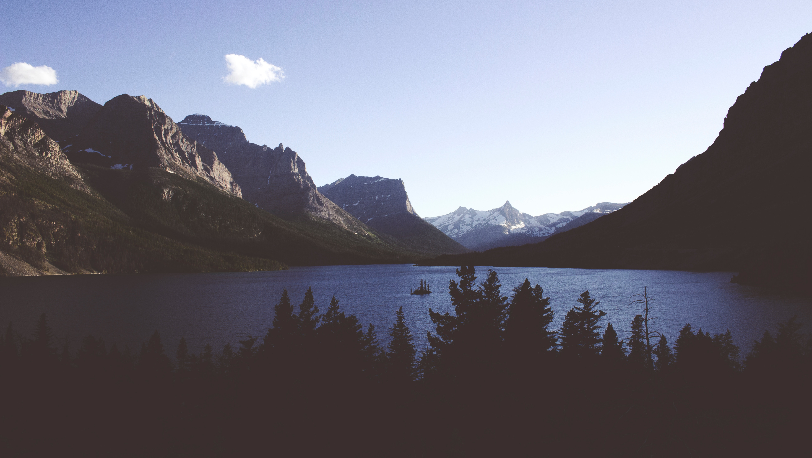
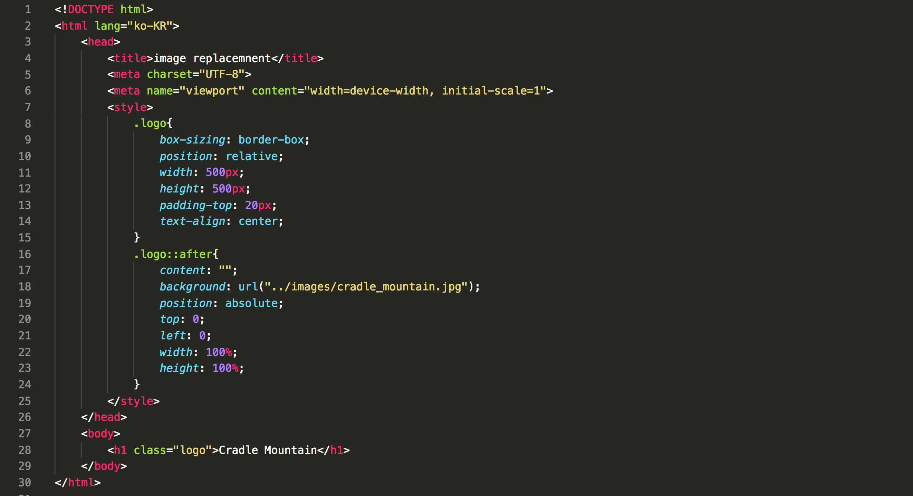
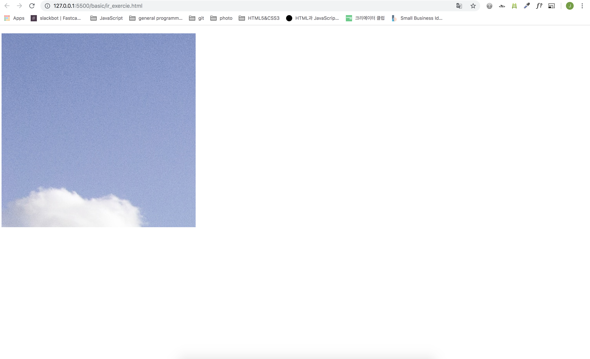

# IR기법을 사용한 실습


## 원본이미지




## HTML | CSS 코드




```
<!DOCTYPE html>
<html lang="ko-KR">
    <head>
        <title>image replacemnent</title>
        <meta charset="UTF-8">
        <meta name="viewport" content="width=device-width, initial-scale=1">
        <style>
            .logo{
                box-sizing: border-box;
                position: relative;
                width: 500px;
                height: 500px;
                padding-top: 20px;
                text-align: center;
            }
            .logo::after{
                content: "";
                background: url("../images/cradle_mountain.jpg");
                position: absolute;
                top: 0;
                left: 0;
                width: 100%;
                height: 100%;
            }
        </style>
    </head>
    <body>
        <h1 class="logo">Cradle Mountain</h1>
    </body>
</html>
```


## 화면 출력





## til

image replacement해서 적용은 잘 된거 같은데 원본 이미지 크기를 고려하지 않다보니 하늘이랑 구름 조금만 나와버렸음ㅋ 이미지 크기를 꼭 생각하자 다음부턴! 이미지를 걷어내면 'Cradle Mountain'이라는 텍스트가 나온다. 패캠에서 수업듣느라고 하루종일 컴퓨터 앞에만 앉아있다보니 등산이 너무 가고싶다 이번주에 가야겠다ㅋㅋ실습 성공인것 같은데..웹접근성이라던가 하는 부분은 더 공부해서 다음에 코드에 추가해봐야겠당. 