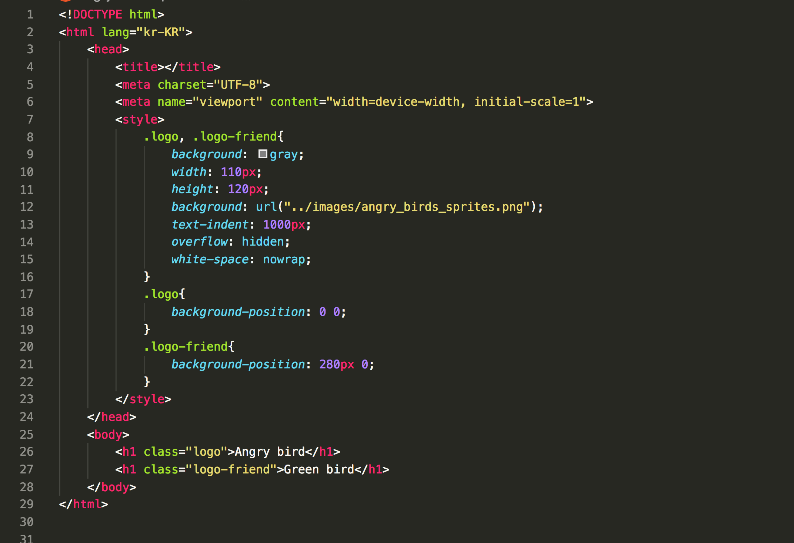
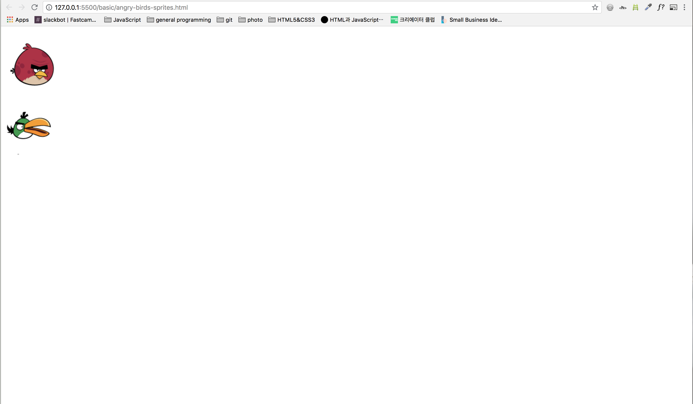

# CSS sprites기법 사용


## 원본이미지 


## HTML | CSS 코드 



* internal css사용


```
<!DOCTYPE html>
<html lang="kr-KR">
    <head>
        <title></title>
        <meta charset="UTF-8">
        <meta name="viewport" content="width=device-width, initial-scale=1">
        <style>
            .logo, .logo-friend{
                background: gray; /* 생략가능! */
                width: 110px;
                height: 120px;
                background: url("../images/angry_birds_sprites.png");
                text-indent: 1000px;
                overflow: hidden;
                white-space: nowrap;
            }
            .logo{
                background-position: 0 0;
            }
            .logo-friend{
                background-position: 280px 0;
            }
        </style>
    </head>
    <body>
        <h1 class="logo">Angry bird</h1>
        <h1 class="logo-friend">Green bird</h1>
    </body>
</html>
```

## 화면 출력모습

