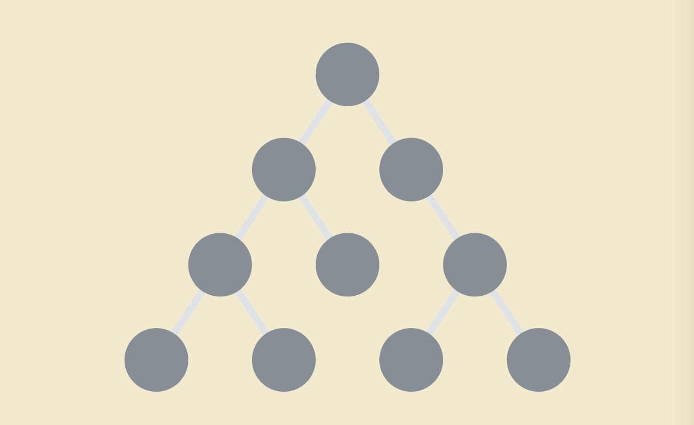
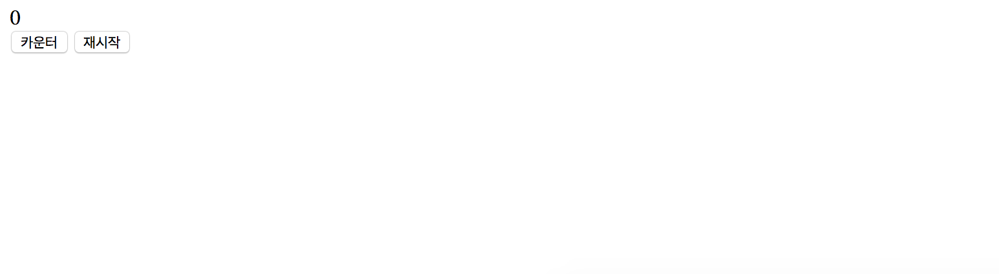
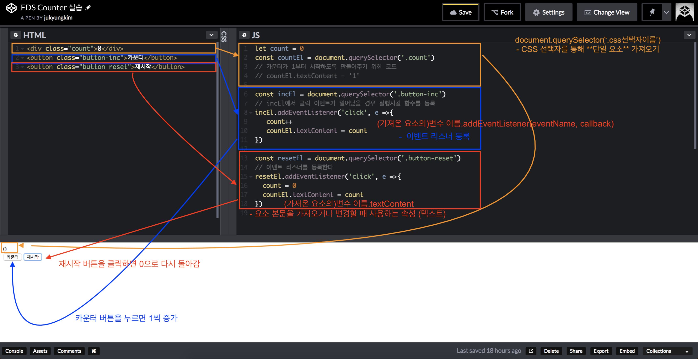

12.Oct.2018 수업내용

* 수업 방향 : React를 사용하기 위해서 필요한 것들을 공부할 예정

# FDS 브라우저 측 JavaScript

## API [Application Programming Interface]

=> [API 공부한 내용](https://github.com/victoryjkkim92/TIL/blob/master/API.md)


## DOM API

*	[Document Object Model](https://developer.mozilla.org/en-US/docs/Web/API/Document_Object_Model)
 
	+ 문서 객체 모델 (DOM)은 HTML, XML 및 SVG 문서를 위한 프로그래밍 인터페이스이다
	+ 문서의 구조화된 표현양식을 트리 형태로 제공한다
	+ DOM은 트리에 대한 접근을 허용하는 메서드를 규정하고, 해당 메서드는 문서의 구조, 양식, 내용을 변경할 수 있다
	+  DOM은 다양한 속성과 메서드를 갖는 노드와 객체의 구조화된 그룹의 형태로 문서를 나타낼 수 있도록 한다
	+  또한 노드는 각기 부여된 이벤트 핸들러를 내포할 수 있으며, 어떠한 이벤트가 발생하면 그에 해당하는 이벤트 핸들러가 실행된다
	+  기본적으로 DOM은 웹페이지와 스크립트 혹은 프로그래밍 언어를 결합하는 역할을 한다
	+  비록 자바스크립트를 이용해 DOM에 접근하는 경우가 종종 있지만, 그것이 자바스크립트 언어의 한 부분은 아닙니다. 기타 언어들로 DOM에 접근할 수도 있습니다

* 트리


	
	
+ 여러 데이터가 계층 구조 안에서 서로 연결된 형태를 나타낼 때 사용된다
	+ 트리를 다룰 때 사용되는 몇 가지 용어
		- 노드(node) : 트리 안에 들어있는 각 항목
		- 자식 노드(child node) : 노드는 여러 자식 노드를 가질 수 있다
		- 부모 노드(parent node) : 노드 A가 노드 B라는 자식으로 갖고 있다면, 노드 A를 노드 B의 '부모 노드'라고 부른다
		- 뿌리 노드(leaf node) : 트리의 가장 상층부에 있는 노드를 말한다
		- 잎 노드(leaf node) : 자식 노드가 없는 노드를 말한다
		- 조상 노드(ancestor node) : 노드 A의 자식을 따라 내려갔을 때 노드 B에 도달할 수 있다면, 노드 A를 노드 B의 조상 노드 라고 부른다.
		- 자손 노드(descendant node) : 노드 A가 노드 B의 조상 노드일 때, 노드 B를 노드 A의 자손 노드라고 부른다. 
		- 형제 노드(sibling node) : 같은 부모 노드를 갖는 다른 노드를 보고 형제 노드라고 부른다.
* Event Reference
* Web APIs

## 요소 선택하기 [You are basically using CSS Selector Syntax]

* `document.querySelector(selector) `- CSS 선택자를 통해 **단일 요소** 가져오기
* `document.querySelectorAll(selector)` - CSS 선택자를 통해 **여러 요소** (배열로)가져오기
* `el.querySelector(selector)` - CSS 선택자를 통해 **단일 자식 요소** 가져오기
* `el.closest(selector)` - 엘리먼트의 조상 중에 CSS 선택자와 일치하는 **가장 가까운 조상 요소** 가져오기
* `el.matches(selector)` - 해당 요소가 CSS 선택자와 일치하는지 검사하기

그래서...

* `querySelector('css selector') ` , `querySelectorAll('css selector')`

+ Caveats [주의 사항]

	+ Not all pseudo-class selectors are allowed. For example, `:visited` or `:link` is ignored
	+ The selector varieties you can use are limited by the level of CSS your browser supports
	+ The selector you specify only applies to the descendants of the element you are starting your search from

> The querySelector and querySelectorAll functions are the new kids on the block.  
> The past was dominated by the getElementById, getElementsByTagName, and getElementsByClassName functions that pretty much did exactly as their names describe.


## 요소 내용 조작하기

* `el.textContent` - 요소 본문을 가져오거나 변경할 때 사용하는 속성 (텍스트)
* `el.innerHTML` - 요소 본문을 가져오거나 변경할 때 사용하는 속성 (HTML)

## 요소 어트리뷰터 조작하기

* `el.hasAttribute(attrName)` - 어트리뷰트가 있는지 검사하기
* `el.getAttribute(attrName)` - 어트리뷰트의 값 가져오기
* `el.setAttribute(attrName, attrValue)` - 어트리뷰트 설정하기
* `el.removeAttribute(attrName)` - 어트리뷰트 삭제하기

## [요소 클래스 조작하기](https://www.kirupa.com/html5/using_the_classlist_api.htm)

* `el.classList.add(className, ...)` - 클래스 추가
* `el.classList.remove(className,...)` - 클래스 삭제
* `el.classList.contains(className)` - 클래스 포함 여부 검사

* [실습](https://codepen.io/victoryjkkim92/pen/YJxmdL)

## 인라인 스타일 조작하기 

* `el.style` - 요소의 인라인 스타일을 읽고 쓸 때 사용하는 객체. `camelCase`사용
	+ `el.style.backgroundColor = #000000` - 요소의 배경색을 검은색으로 변경
	

* 예제 코드

Single element : 

```js
const myElement = document.querySelector('#superman') // css id선택자 이름이 superman
myElemeny.style.backgroundColor = #D93600
```
Multiple elements : 

```js
const myElements = document.querySelectorAll('.bar') // css class선택자 이름이 bar

for (let i = 0; i < myElements.length; i++){
	myElements[i].style.opacity = 0;
}
```


## 이벤트 리스너

* `el.addEventListener(eventName, callback)` - 이벤트 리스너 등록
* `el.removeEventListener(eventName, callback)` - 이벤트 리스너 제거


## 오늘 한 실습 [codepen.io](https://codepen.io)

### 🐮1. [Counter 실습](https://codepen.io/dbeat999/pen/JmJmGa) 

**예제 HTML 코드**

```html
<div class="count">0</div>
<button class="button-inc">카운터</button>
<button class="button-reset">재시작</button>
```
**화면 출력상황**


**자바스크립트를 이용해서 화면 조작하기**



### 🐮1.  [Form Scripting 실습](https://codepen.io/victoryjkkim92/pen/xyrvzX) 


# TIL

* DOM TREE 에 있는 요소들을 가리키는 용어 node!
* 예전에는 `getElementById`, `getElementsByTagName`, `getElementsByClassName`를 사용했는데, 요즘은 `querySelector`, `querySelectorAll`을 사용하는 추세


