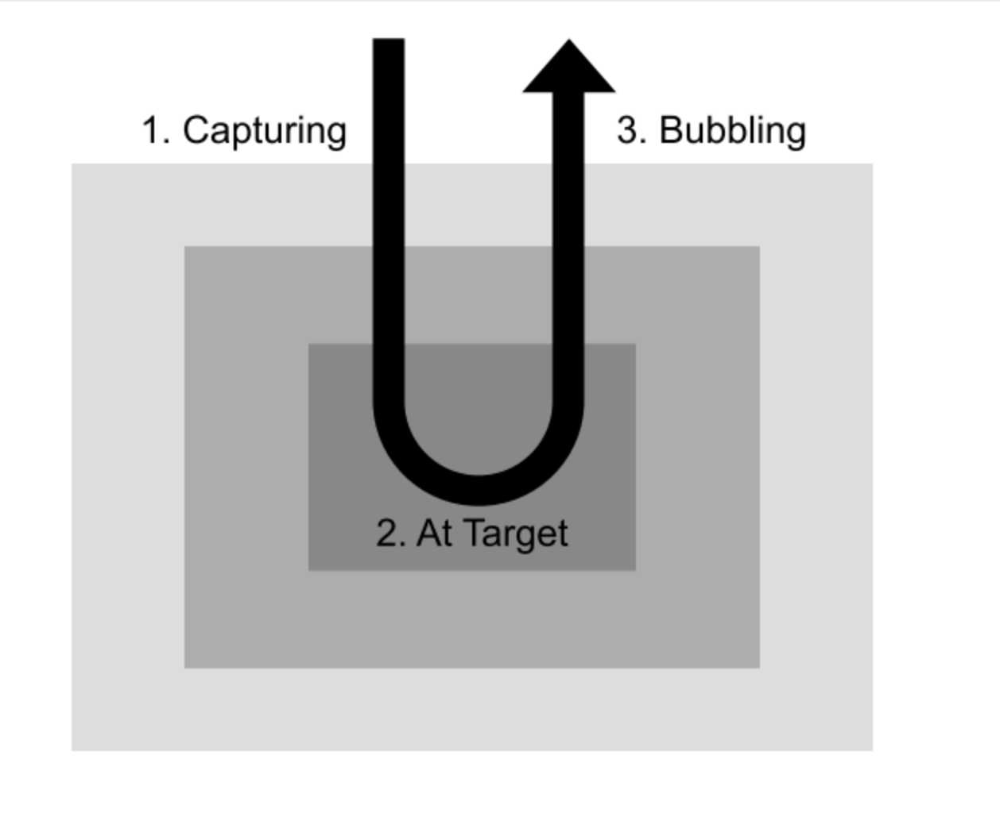

15.Oct.2018_강의내용 추가

## [이벤트 리스너](https://codepen.io/victoryjkkim92/pen/jewoKL)

* `el.addEventListener(eventName, callback)` - 이벤트 리스너 등록
* `el.removeEventListener(eventName, callback)` - 이벤트 리스너 제거

## DOM 엘리먼트 생성하기

* `document.createElement(tagName)` - 새로운 엘리먼트 객체 생성하기
* `el.cloneNode(true/false)` - 엘리먼트 복사하기

	+ In order for an element to be a part of the DOM, there are two things we need to do : 
	
		- Find an element that will act as the parent
		- Use `appendChild` and add the element you want into that parent element

## DOM 트리 조작하기 

* `el.appendChild(newChild)` - 요소 끝에 자식 요소 삽입하기
* `el.insertBefore(newChild, beforeWhat)`- 원하는 위치에 자식 요소를 삽입하기
	+ `el.insertBefore(newChild, null)` 은 `el.appendChild(newChild)`와 같은 역할
	+ 이미 문서에 존재하는 요소객체를 인수에 넣어 호출하면, 그 요소객체를 복사하지 않고 위치를 이동시킴
* `el.replaceChild(newChild, oldChild)` - 자식 요소를 교체하기
* `el.removeChild(child)` - 자식 요소 제거하기


### 코드 예제

* 요소 끝에 자식 요소 삽입하기

```js
const newElement = document.createElement("p") // p태그를 생성
newElement.textContent = "Hello, Stranger."; // 요소 내용에 "Hello, Stranger."를 텍스트 형태로 삽입

document.body.appendChild(newElement); // body태그의 (가장 하위)자식요소로 삽입 
```
> 추가한 요소를 삽입하고 싶을 때 : 아래에 document.body.removeChild(newElement); 추가해주면됨


* 만약 특정 위치에 추가하고 싶다면..?
	+ body 태그 안에 h1, script, p(새롭게 생성된) 태그가 순서대로 있다고 가정

```js
const newElement = document.createElement("p") 
newElement.textContent = "Hello, Stranger."; 

const scriptElement = document.querySelector("script") // script 태그를 찾아서
document.body.insertBefore(newElement, scriptElement); // 그 앞에 삽입해줌, 순서 :  h1 - p - script 
```

* 엘리먼트 복사하기

```js
const share = document.querySelector('.share'); // share라는 이름을 가진 css선택자
cosnt shareClone = share.cloneNode(false); // false일 때는 그 요소만, true일 때는 자식요소까지 복사됨

document.querySelector('#footer').appendChild(shareClone);  
```

## dataset

* `el.dataset`- `data-*` 어트리뷰트를 가져오기. (`kebab-case`가 `camelCase`로 변환됨)
	+ html에 데이터를 저장하고싶다!할 때 사용하세요 : ) 자바스크립트로 가져오기 편하니까요

## 노드 간 관계

* `el.childNodes` - 자식 노드
* `el.firstElementChild` - 첫 번째 자식 요소
* `el.lastElementChild` - 마지막 자식 요소
* `el.previousElementSibling` - 이전 형제 요소
* `el.nextElementSibling` - 다음 형제 요소
* `el.parentElement` - 부모요소
* `el.offsetParent` - 포지셔닝의 기준이 되는 조상 요소

## 요소의 크기 및 위치

* `el.getBoundingClientRect()` - 화면 좌측 상단으로부터의 요소의 위치 및 요소의 크기를 반환

	+ 예제 코드

	```js
	const formEl = document.querySelector('form')
	undefined
	formEl.getBoundingClientRect()
	DOMRect {x: 10, y: 10, width: 300, height: 262, top: 10, …}
	bottom: 272
	height: 262
	left: 10
	right: 310
	top: 10
	width: 300
	x: 10
	y: 10
	__proto__: DOMRect
	```

* `el.offsetHeight` / `el.offsetWidth` - border를 포함한 요소의 크기
* `el.clientHight` / `el.clientWidth` - border를 제외한 요소의 크기
* `el.scrollHeight` / `el.scrollWidth` - 요소 내부에 포함된 콘텐츠의 크기 (스크롤 가능한 영역의 크기)
* `el.offsetTop` /  `el.offsetLeft` - offsetParent로부터의 요소의 위치 | position : relative, position : absolute 
* `el.scrollTop` / `el.scrollLeft` - 요소 내부의 콘텐츠가 스크롤된 정도
* `el.cliendTop` / `el.clientLeft` - border의 너비

## 이벤트 객체 

* `e.target` - 실제로 이벤트를 일으킨 요소
* `e.currentTarget` - 이벤트 전파 과정 중 현재 이벤트가 위치한 요소
* `e.stopPropagation()` - 이벤트 전파 과정을 멈추기 // 이후 이벤트 전파과정이 끝!
* `e.preventDefault()` - 이벤트가 일으키는 브라우저의 기본 동작과정을 취소하기

* [예제 코드](https://codepen.io/victoryjkkim92/pen/jewoKL) 

```js
//이벤트가 일으키는 브라우저의 기본 동작과정을 취소하기
document.querySelector('.google').addEventListener('click', e => {
  e.preventDefault()
})
```


## 폼 이벤트

* `change` - checkbox, radio 등의 타입을 갖는 input 요소나 select 요소에 선택이 일어났을 때 발생
* `input` - text타입을 갖는 input요소나 textarea 요소의 값이 변경되었을 때 발생
* `focus` - 키보드 포커스가 해당 요소에 옮겨졌을 때 발생
* `blur` - 키보드 포커스가 해당 요소에서 벗어났을 때 발생
* `submit` - 폼 전송이 일어났을 때 발생

## 마우스 이벤트 

* `click` / `dbclick` - 마우스 클릭 / 더블클릭
* `mouseover` / `mouseout` - 요소에 마우스 포인터가 들어왔을 때 / 나갔을 때
* `mousedown` / `moustup` - 요소 위에서 마우스 버튼을 눌렀을 때 / 놓았을 때
* `mousemove` - 요소 위에서 마우스 포인터가 움직일 때마다

## 키보드 이벤트 

* `keydown` / `keyup` - 키보드 버튼을 눌렀을 때 / 놓았을 때
* `keypress` - 문자가 입력되었을 때

## 스크롤 이벤트 

* `scroll` - 요소 내부의 콘텐츠가 스크롤 될 때마다

## 이벤트 전파

* [실습코드](https://codepen.io/victoryjkkim92/pen/qJVWwM)



* 버블링이 일어나는 이벤트도 있고, 일어나지 않는 이벤트도 있다(submit, focus, blue, change 등)

# TIL

* `document.createElement(tagName)`을 통해 생성된 요소객체는 문서 밖에 있을 수도, 안에 있을 수도 있다
*  `el.appendChild(newChild)`와 `el.insertBefore(newChild, beforeWhat)`는 요소객체의 위치를 이동시킬 때에도 사용된다
*  이벤트 전파 : Capturing, At target, Bubbling 3 단계로 나뉜다
	+ .addEventListener를 하면 bubbling 단계에서만 실행된다
	+ 만약 capturing단계에서 실행시키고 싶다면 코드 마지막에 true를 추가해주면 된다 
	+ A **true** value means capture. A **false** value means bubble. 
	+ 예시 코드
	
	```js
		document.querySelector('.outer').addEventListener('click', e => {
		  alert('outer가 클릭되었습니다.');
		  // alert('target의 class:' + e.target.getAttribute('class'));
		  // alert('currentTarget의 class:' + e.currentTarget.getAttribute('class'));
		}, true);
	```
	

