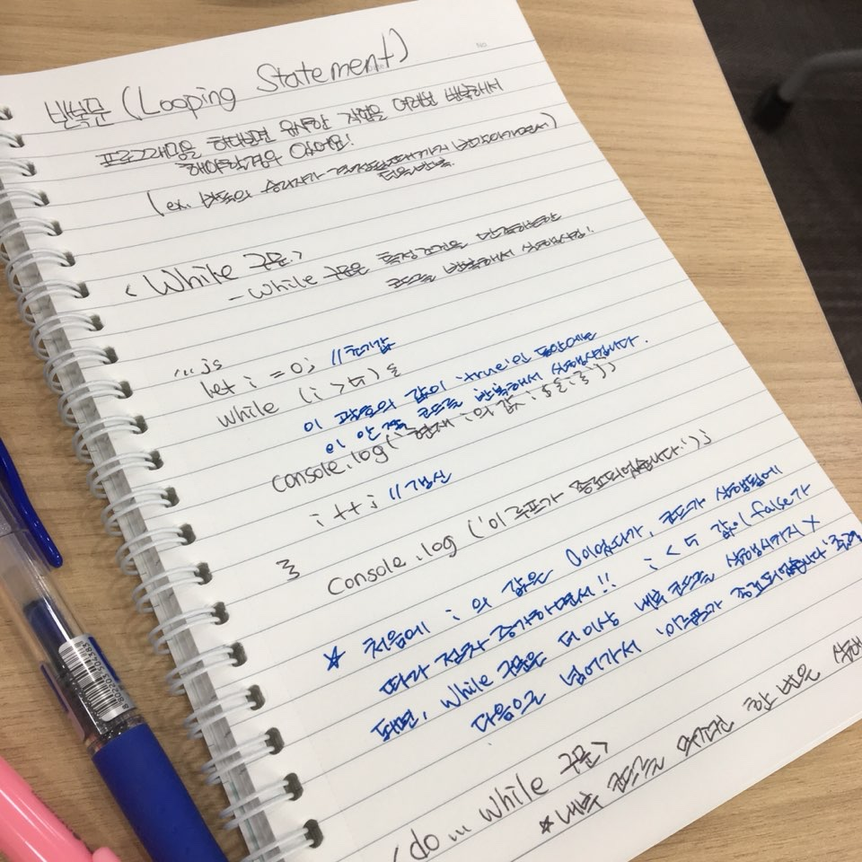

# 함수 

* 함수 기본 구조

```js
function add (x,y){
	const result = x + y
	return result;
}
add(7,3);
```

이런 함수가 있다고 할 때,

+ function 뒤에 `add`는 함수의 이름
+ (x,y) 괄호 안의 x, y는 매개변수 | parameter
+ return result; 부분의 result는 반환 값
+ add(7,3);은 위에 정의한 함수를 호출하는 방법으로 괄호안의 숫자들은 인자 | argument

> 함수를 정의한 다음 꼭 호출을 해줘야 실행이 된다!

## 스코프 scope

특정 변수가 유효한 코드 상의 유효범위 = 스코프

* 스코프 연쇄

```js
const five = 5;
function add5(x){
	function add(y){
		return x + y;
	}
	return add(five);
}
add5(3); // 8
```

"코드의 흐름이 식별자에 도달하면, 먼저 식별자와 같은 이름을 갖는 변수르르 현재 스코프 안에서 찾아보고 있으면 사용! 없으면 바깥 스코프로 올라가서 찾아보는 과정 되풀이"

> 가장 바깥에 있는 스코프를 **최상위 스코프(top-level scope, 전역 스코프(global scope)**라고 한다.


## 변수 가리기 (variable shadowing)

바깥쪽 스코프에 존재하는 변수와 같은 이름을 가지는 변수를 안쪽 스코프에서 재정의 할 수 있다 -> 안쪽 스코프 에서는 바깥쪽 스코프 이름 무시!

## 어휘적 스코핑 (lexical scoping)

스코프는 코드가 작섣왼 구조에 의해서 결정되는 것이다! 함수 호출 형태 아님!!!!!!


## 값으로서의 함수 

* 함수를 배열[]이나 객체{}에 넣을 수 있다
* 함수를 인수로 넘길 수 있다
* 함수에서 함수 반환 할 수 있다 

## 익명함수 (anonymous function / function iteral)

언제 쓰임? 함수를 만든 쪽이 아니라 다른 쪽에서 그 함수를 호출 할 때 자주 씀

## 화살표 함수 (arrow function)

```js
const add = (x,y) => x + y;
```

* 표기법이 간단해서 익명함수를 다른함수의 인수로 넘길 떄 주로 사용


# 제어구문

실제로 사용되는 프로그래밍들은 복잡한 논리구조를 가지고 있고, 그 논리구조들을 표현할 수 있는 조건문과 반복문!

## 조건문(conditional statement)

우리가 실제로 사용하는 프로그램들은 수 많은 경우의 수를 다루고 있다. 

`if...else`구문

```js
function roll() {
  return Math.ceil(Math.random() * 6);
}

function game() {
  const result = roll();

  alert(`결과: ${result}`);

  // if...else 구문
  if (result >= 4) {
    // 괄호 안의 조건을 만족하면, 즉 결과값이 true 이면
    // 이 영역의 코드가 실행된다.
    alert('당신이 이겼습니다!');
  } else {
    // 위 조건을 만족하지 않으면, 즉 결과값이 false 이면
    // 대신 이 영역의 코드가 실행된다.
    alert('당신이 졌습니다.');
  }
}

game();
```

else가 필요없는 상황이라면 생략가능

3개이상의 조건을 다루어야 할 경우 -> if, if else, if else, ... , else

> if else는 중첩에 제한이 없음


## switch 구문

변수에 대해 많은 경우의 수가 있는 경우

switch 구문은 `case`, `break`, `default`와 짝꿍!

```js
function translateColor(english) {
  let result;
  switch (english) {
    case 'red':
      result = '빨강색';
      break;
    case 'blue':
      result = '파랑색';
      break;
    case 'purple':
      result = '보라색';
      break;
    case 'violet':
      result = '보라색';
      break;
    default:
      result = '일치하는 색깔이 없습니다.';
  }
  return result;
}
```

* switch () 괄호 안에 들어오는 값은 코드 실행 여부를 판별할 기준이 되는 값
* case '' 따옴표 뒤에 들어가는 값은 기준이 되는 값과 일치하면
* result = 를 실행함
* 아니면 default: 를 실행

> case 뒤쪽의 코드 영역 마지막에 break;를 써주지 않으면 뒤쪽 코드영역이 실행되기 때문에 조심!


## 반복문 (looping statement)

프로그래밍을 하다보면 유사한 작업을 여러번 반복해서 해야 할 경우 있어요 (ex. 바둑의 승리자가 결정될 때까지 번갈아가면서 턴을 반복)

### while 구문 

while구문은 특정 조건을 만족하는한 코드를 반복해서 실행시킴

```js
let i = 0; // 초기값

while (i < 5) {
  // 위 괄호의 값이 `true`인 동안에는
  // 이 안쪽의 코드를 반복해서 실행시킵니다.
  console.log(`현재 i의 값: ${i}`);
  i++; // 갱신
}

console.log('루프가 종료되었습니다.');
```

* 처음에 i의 값은 0이엇다가, 코드가 실행됨에 따라 점차 증가하면서!! i< 5 값이 false가 되면, while구문은 더이상 내부 코드를 실행시키지 않고 다음으로 넘어가서 루프가 종료되었습니다' 출력


`do...while`구문

내부 코드를 무조건 한 번은 실행시킨다.

### for구문

루프의 초기값과 갱신에 대한 코드를 짧게 작성할 수 있다

```js
for(let i = 0; i<5; i++){
	console.log(`현재 i의 값 : ${i}`);
}
console.log('루프가 종료되었습니다.')
```

#### 배열의 순회

ES2015 전 for구문이 배열을 순회하는 데에도 많이 사용되었다. 요즘엔, forEach메소드나 for ...of 구문이 더 많이 쓰인다

#### `break`,`continue` 

루프를 도중에 멈추거나 루프의 다음 번 차례로 넘어가야 할 경우 사용되는 구문이다

#### 함수 즉시 종료하기

`return`과 `throw`는 함수의 나머지 코드를 건너뛰고 함수를 즉시 종료시키는 결과를 낳는다.


# 오늘 공부하면서 배운점 / 느낀점 (9월 29일 토요일)

자바스크립스 수업이 시작한지 2일이 지났고, 오후 수업시간 두시간 정도는 알고리즘 문제를 푸는데 ㅠㅠ 아무래도 자바스크립트에 대한 기본기가 부족하다보니 코드 작성을 하는데 어려움을 겪을 때가 있었다. 공부를 할 때 남들과 비교를 하는 것과 내 스스로의 능력을 의심하는게 최악의 적이라고 생각을 하는데, 내가 그렇게 생각을 할 것 같은 느낌을 받았다. 그래서 수업이 없는 토요일에 도시락을 싸서 학원에 자슴하러 왔다. 날씨는 어찌나 좋은지 놀러가고싶었지만 꾹 참았다ㅠㅠ

함수, for문, if문을 사용을 해서 코드를 어느정도는 작성 할 수 있었지만 선생님 교재를 보면서 예제 코드를 손으로도 적어보고 repl.it에서 입력해서 출력되는 값을 보면서 부족한 부분을 공부해 나갔다. switch문은 한번도 사용해 보지 않았는데 if문 작성하는게 익숙해지고 나면 switch문으로 바꿔보는 시도를 해봐야겠다. 

JavaScript기초 부분에 객체파트와 배열 파트가 남았는데 이번 주말을 통해서 꼭 한번 읽어보고 내 나름 정리를 해가면서 꼭 내것으로 만들고 싶다. 늦게 시작한터라 조바심이 나는 것은 사실이지만, 한편으론 시간이 조금 더 걸린다고 해도 기본기를 탄탄하게 다지고 싶다! 

화이팅!

아 맞아 난 손으로 쓰면서 공부를 해야 역시 잘되나보다ㅠㅠ




